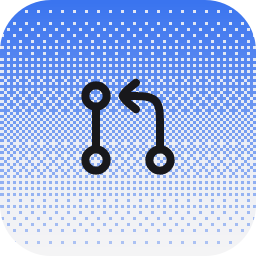

<p align="center">
  <picture>
    <source media="(prefers-color-scheme: dark)" srcset="./icon-dark.png" />
    
  </picture>
</p>

<div align="center">

# Pull Requests

</div>

A GitHub-first pull-request inbox: browse authored and review-requested work across repositories, inspect descriptions, files, checks, tasks, subtasks and activity, then review, manage stacked pull requests or merge through the locally authenticated GitHub CLI.

> **The public home of `ryu-pull-requests`.** Source, builds, and releases live here —
> binaries for every platform are attached to each release.
>
> This tree is generated from the Ryu monorepo, so commits pushed here
> directly are replaced on the next sync. **Pull requests are welcome** —
> open them here and they are ported into the monorepo, then flow back out.
> Ryu as a whole: https://github.com/amajorai/ryu

## Install

**App:** [Install](ryu://apps/@ryu/pull-requests) (opens the Ryu desktop app and asks you to confirm)

**CLI:**

```bash
ryu apps add @ryu/pull-requests
```

## Source & build

The **source of record** for this app: a dependency-free Bun/TypeScript
`sidecar/` Ryu runs locally as a grant-gated control capability, plus the
manifest `ui/`. The sidecar builds standalone — `cd sidecar && bun install &&
bun run build` compiles a single `ryu-pull-requests` executable; each release attaches
the per-platform binaries.

## License

Apache-2.0 — see [LICENSE](./LICENSE).

## What it does

- Lists open, closed and merged pull requests involving you, authored by you, or
  waiting for your review.
- Shows the description, branches, additions/deletions, reviewers, changed files,
  checks, reviews and comments without cloning every repository.
- Loads the patch on demand instead of putting a potentially large diff in every
  list response.
- Posts comments, approves, requests changes, marks drafts ready, and merges with
  merge/squash/rebase strategies.
- Reads GitHub's stacked pull-request relationships and shows the stack from its
  trunk to the selected layer. Create a stack, add layers, unstack it, or merge the
  stack from the selected pull request; queued stack merges are tracked until GitHub
  reports their final state.
- Extracts Markdown task-list items from pull-request descriptions and shows linked
  closing issues alongside the review summary. It also shows GitHub sub-issues as
  subtasks with completion progress. These task items and relationships are read-only
  in the app; edit the pull-request body or issue relationship in GitHub.
- Uses the existing `gh` installation and opens GitHub's browser device flow when
  sign-in is needed. The app never receives or persists a GitHub token.
- Supplies the branch-to-PR lookup and check rollup used by the desktop Environment
  summary and chat-sidebar hover cards, including comment counts and the user-triggered
  CI report attachment action.
- Keeps all GitHub operations behind the local authenticated `gh` CLI; the desktop does
  not call GitHub's web API directly.

## Issues

The **Issues** tab uses the same GitHub sign-in and local CLI integration as Pull
Requests. It lists issues you are involved in, assigned to you, or authored by you;
supports open and closed filters and search; and shows the issue description, labels,
assignees and discussion. From the detail view you can comment, close, reopen, or
open the issue on GitHub.

## Architecture

`sidecar/` is a dependency-free Bun service that invokes `gh` with argument arrays
(never a shell command), validates every repository/number/action, binds loopback,
and requires Core's per-app bearer token. `ui/` is a sandboxed, single-file React
companion. It reaches only its own manifest-declared routes through the generic
`app.request` bridge and Core's ext-proxy allowlist.

The backend has a small provider boundary: the HTTP/UI contract talks about pull
requests, while `github.ts` owns GitHub CLI translation. GitLab support can therefore
be added later as a second provider (likely through `glab`) without changing Core,
Gateway, or the companion's core information architecture.

## Requirements

- [GitHub CLI](https://cli.github.com/) available as `gh`

Open Pull Requests and choose **Sign in with GitHub**. The app displays GitHub's
one-time code, opens the verification page, and waits for authorization. GitHub CLI
owns the login and credential storage. You can still run `gh auth login` directly as
a fallback.

The app is GitHub-only in this first slice. GitLab, Bitbucket, inline line comments,
and editing pull-request descriptions or task lists are intentionally not included
yet. Stacked pull requests use GitHub's public-preview Stacks API, so the feature is
available only where the signed-in account and repository support that GitHub API.
